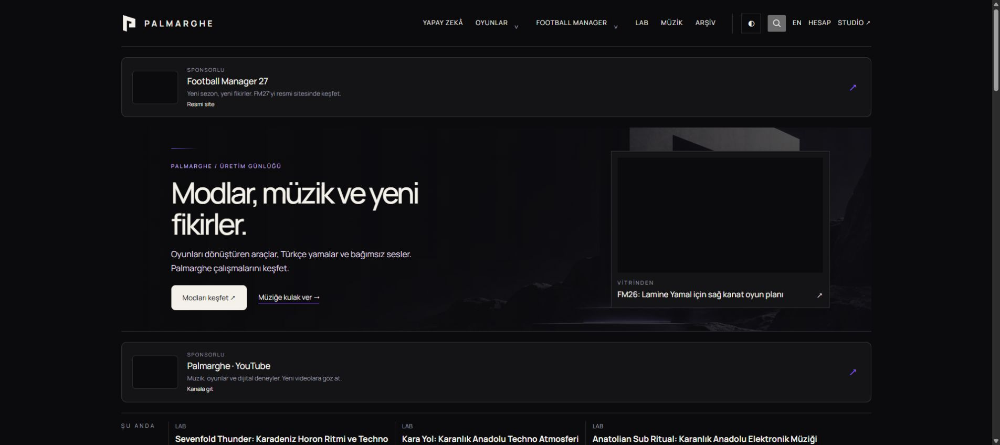
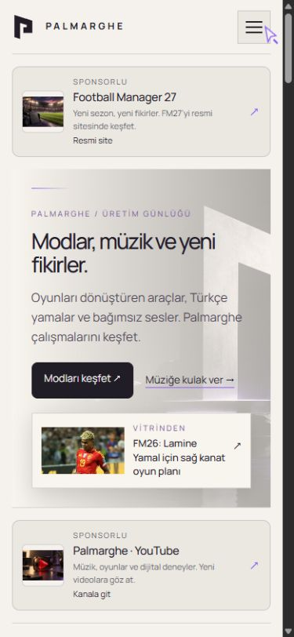
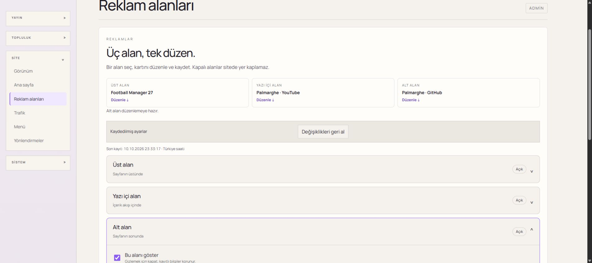
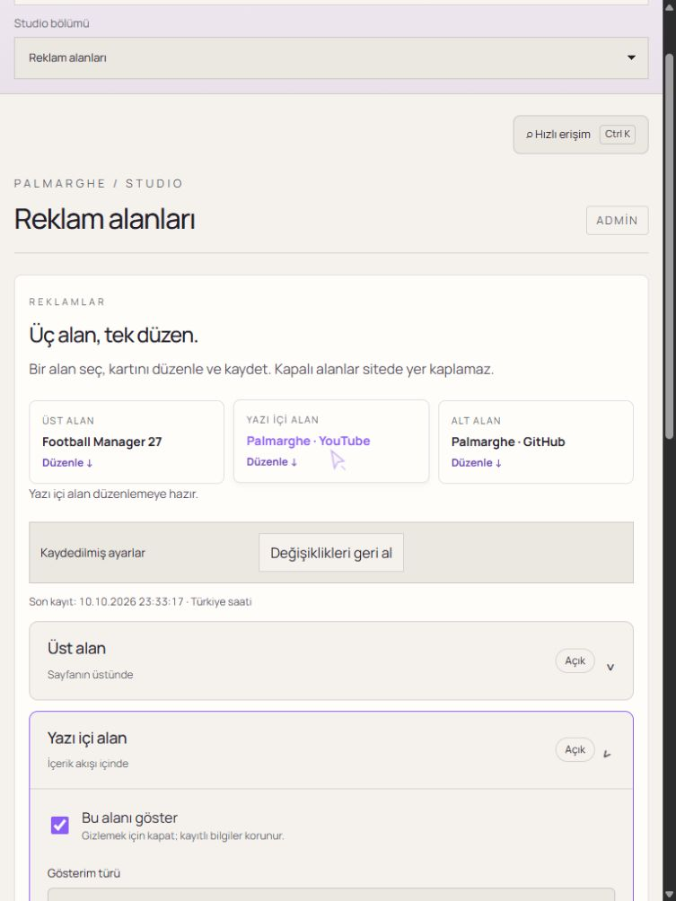

# Sponsor card rebuild — 10 October 2026

## Requested replacement
The user rejected the previous wide advertisement bands and requested a fresh, aligned design with independent visibility and clearer management. The old split-band presentation was removed, preserving existing production advertisement records, original artwork, placement keys, authorization, analytics hooks, scheduling and device/page filters.

## Implemented design
- Shared neutral editorial card: small framed original artwork on the left, title/description in the middle, restrained action arrow on the right. No billboard artwork, overlaid text or fixed half-empty image panels.
- Public header/article/footer placements follow the same content gutters at desktop, tablet and both narrow-phone breakpoints. Missing artwork does not leave an empty image column. Hidden placements render no reserved space.
- Dark, light and hidden Aurora use existing theme variables. Text contrast is audited; the theme background changes immediately, without a low-contrast interpolation.
- New Studio manager: compact placement shortcuts, native accordion panels, explicit show/hide state, simple copy/link/image controls and per-panel unsaved live preview. Device/page/schedule/AdSense controls are disclosed as advanced settings.
- Dashboard edit links open the requested panel on initial hash navigation. In-page shortcuts open it, focus the visibility control and announce the destination. Native panels also work independently of JavaScript.
- Existing pending, duplicate-submit prevention, input recovery, saved time and undo behavior remains integrated. Hidden/closed panel fields are still saved together. Invalid native fields open their containing panels before validation focus.
- AdSense preview explicitly describes runtime-delivered advertising rather than pretending a first-party sample is the Google result.

## Review and test record
- First focused attempt found contrast interpolation; removed background interpolation. Another attempt found breakpoint gutters and small CTA contrast; corrected the implementation without relaxing tests.
- Full initial visual comparison: 60 unchanged, 36 intentional differences (home/search/archive/advertising × 3 widths × 3 themes). Review exposed an injected preview-device toolbar occupying a grid column; wrapped the toolbar/preview in one column and added a physical alignment assertion.
- Reviewed all 36 replacement references using contact sheets and full-size Studio/public examples. Updated only these references, preserving all original comparison thresholds/masks. Final full visual comparison: 96/96 passed in 1.2 minutes.
- Focused local advertisement/navigation run: 18/18 passed in 39.3 seconds, including persisted edits and unchanged closed-panel fields; local test configuration restored in finally blocks. No production setting was written by these tests.

## Release evidence
Final local verify: 284 checked files, zero diagnostics, 244/244 unit tests and build passed at19:59:48 Istanbul. Final focused advertisement run including the AdSense preview assertion:3/3 passed in29.9s. Implementation source516c673 was deployed and all three CI jobs passed (run38070328482,150functional E2E). The latest generated-asset release and approved live data replacement are recorded below. The previous deployed runtime remains historical evidence in advertisement-balance-2026-10-10.md.

## Approved FM27 / YouTube / GitHub replacement
- Runtime4e66fc9; clean committed build10Oct23:30:44 Istanbul; Worker f7bcb8bd-1ac9-47f1-8e9f-8a8d38a1e602.
- Header links to https://www.footballmanager.com/; article links to https://www.youtube.com/@palmarghe; footer links to https://github.com/Palmarghe.
- Built-in imagegen produced three reviewed editorial illustrations, optimized without cropping to512px WebP. They are not official platform assets/game screenshots. [Exact prompts and saved asset paths](sponsor-art-prompts-2026-10-10.md). Combined82,972bytes.
- All six asset reads across public and Studio hosts returned200/image-webp and exact expected lengths before database update.
- Backed up the sole advertising row in advertising-before-fm27-youtube-github-2026-10-10.json. Executed advertising-fm27-youtube-github-2026-10-10.sql through the authenticated linked Supabase CLI. Transactional exact-value concurrency guard succeeded; readback equals the prepared JSON exactly. Timestamp2026-10-10T20:33:17.530712Z. Device/scope/schedule/visibility/publisher/slots unchanged.
- Rollback: read and compare the current row first, then restore the saved previous value with the same conditional transaction; refuse later user edits rather than overwriting them. Versioned previous images remain available. No schema migration or user/content/media mutations.
- Actual native Chrome:all three public titles/destinations and loaded512px images match. Authenticated Studio footer shortcut opens and focuses the correct editor; unsaved hide removes its card; undo restores checked state. Tablet article shortcut opens/focuses YouTube. No production UI save during QA.
- Mobile390/client375 has all three card left16,width343 and scroll375; Studio tablet client/scroll753. Public and Studio consoles contain no captured errors/warnings. Theme/viewport restored. Saved sponsor-native-public, sponsor-native-mobile-light, sponsor-native-studio and sponsor-native-tablet-studio PNGs.
- Fresh post-update production bundle:11/11 passed2.1m. Initial earlier3738020 bundle10/11 traced oldglobal.Dh1iQDsK.css during deployment propagation; current unchanged geometry/WCAG test passes.
- Latest source Actions run38084033669 completed successfully; all terminal evidence below.

## Native Chrome screenshots

Latest asset-source verify job114306647253 succeeded:244units/47files,150/150functional E2E11.0m. Visual job114306647092 succeeded:96/96 in1.3m. Actual signed-in native GitHub Chrome confirms those counts. Production-smoke job114309077120 follows.

Final source Actions38084033669:verify/visual/production-smoke all succeeded. Verify282clean CI files/zero diagnostics,244units,150functional cases;96visual cases;33production smoke cases. Documentation-only final commit uses [skip ci] to avoid repeating the identical verified runtime. Ordinary push preserves history; no force push.

Native GitHub Chrome confirms Success for all three jobs; screenshot: sponsor-native-actions-2026-10-10.png. Production smoke33/33 passed4.2m.

